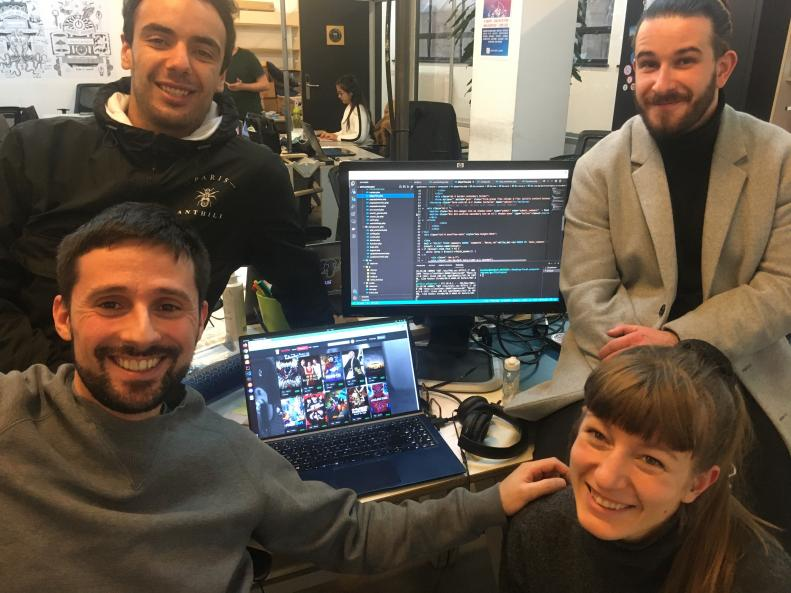

# GetFlixProject - Welcome in our :sparkles: :sparkles: streaming plateform :sparkles: :sparkles: ! 

## What is GetFlix?
GetFlix is a streaming site inspired by platforms such as NetFlix, with a catalog of movies which the users can filter in the search bar. The site includes also a space to comment on the content. Administrators have access to a database to manage the comments.

## Why GetFlix?
This project was build in the context of BeCode Web Development course. The main goal was to consolidate our skills of PHP and MySQL, as well as the ability to communicate and work in a team.

## Creation process of GetFlix
We had 10 days to complete the task. 
Our first step was to think about the design and content of our future site. We did a lot of research on the internet to acquire enough knowledge to start. 

The second step was to think about the deployment of the website. As instruction we had to use docker, MyPHPAdmin and MariaDB. We took a moment to get familiar with those technologies by registering and creating a first database. 

We splitted the tasks between us as following:
+ Ivan was the project manager and he was in charge of both the back-end and front-end development;
+ Sofian was in charge of the front-end development part;
+ Nicolas was in charge of the back-end development part;
+ Anne was in charge of the back-end development part; 

We had daily meetings to monitor the development of the project, indentify difficulties or redefines tasks.

### features of the website ... 
In the end of the project, we have been able to produce a website with the following features:

+ A session system: registration, connection/disconnection;
+ Different rights: to have the right to comment a film, you have to first be registered. If you are not yet registered, an message will appear to invite you to do it. 
+ A search bar with filters, where you can search different films categories.
+
+

## Challenges
1. Creation and coordination of Github branches
We had all to create our own development branch and work on it. To facilitate the coordination, Ivan was our Git Master. His role was validate all the commit to merge everything on the main development branch.

2. To create a system of comments

3. To make our code secure:
We had to protect the data of our users. To make this possible we have decided to add a hash function in our PHP code. This hash function encrypts as an example the code of the password users. so that even in the database it is not impossible for the website administrators tp read the secret information users.

4. To deploy the website

## Somes pictures ...

### Our homepage

## Tools
+ HTML5 <i class="cib-html5"></i>
+ Bootstrap <i class="cib-bootstrap"></i>
+ Javascript <i class="cib-javascript"></i>
+ PHP <i class="cib-php"></i>

## Our dream team

The birth of this streaming plateform wouldn't have been possible without

+ The brillant Ivan Dandrea :frog:
+ The artful Sofian Mattheus :chicken:
+ The crafty Nicolas Valiascas :snail:
+ The cunning Anne Jungers :monkey_face:

## Link to our site

## End word

We wish you a lot of fun visiting our Getflix plateform :movie_camera: :movie_camera: :movie_camera: !

